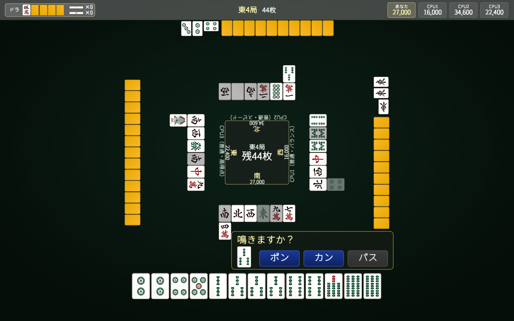

# riichi_mahjong_rs

[日本語版はこちら](./docs/README.ja.md)

Implementation for Japanese Riichi Mahjong in Rust.

## Current status

- Shanten calculation is implemented.
- [Yaku](https://en.wikipedia.org/wiki/Japanese_Mahjong_yaku) evaluation is implemented.
- Fu calculation and score calculation are implemented.
- A playable client that runs in both native and WASM builds is included.
  - The current client is a temporary simplified version.
  - CPU opponents are implemented, with selectable strengths (weak / normal / strong) and personalities (balanced / speedy / high-value / defensive). They use strategy conventions for discard efficiency, calling, riichi/damaten judgement, push/fold, and threat-based defense (including suji/flush/yakuman reads).
- Online multiplayer (room-code based) is supported via `mahjong-net-server`.
  - Host creates a room, shares a 6-character code, and friends join; empty seats are filled by the CPU.
  - Disconnected players are taken over by the CPU and can rejoin to resync.
- Vercel deployment using the included scripts is supported (static web client).

## Structure

### Crate structure

This repository is currently composed of the following crates.

- `mahjong-core`: core logic such as hand representation, shanten calculation, yaku evaluation, fu calculation, and score calculation
- `mahjong-server`: progression management and rule handling used for local matches
- `mahjong-client`: a Macroquad-based four-player Riichi Mahjong client that supports both native and browser execution
- `mahjong-net-server`: a single-binary WebSocket server (tokio + axum) that hosts online room-code matches

### Directory structure

- `crates/`: workspace crates
- `assets/`: runtime assets such as fonts
- `public/`: web assets for deployment
- `scripts/`: build scripts used for deployment
- `index.html`: local web entry point for the WASM client
- `vercel.json`: Vercel build configuration

## Development

First, make sure that the latest stable Rust compiler and Cargo are installed.

~~~sh
rustc --version
cargo --version
~~~

If Rust or Cargo is not installed, install them using [rustup](https://rustup.rs) and follow the setup instructions for your platform.

Then clone the repository and move into the project directory.

~~~sh
git clone git@github.com:h1g0/riichi_mahjong_rs.git
cd riichi_mahjong_rs
~~~

If you want to run the project locally with WASM, add the WASM target.

~~~sh
rustup target add wasm32-unknown-unknown
~~~

### Commands

Run tests:

~~~sh
cargo test
~~~

Run the native client locally:

~~~sh
cargo run -p mahjong-client
~~~

Build the browser client locally:

~~~sh
cargo build -p mahjong-client --target wasm32-unknown-unknown --release
~~~

After building, serve this repository with any local static file server you prefer and open index.html to view the generated WASM client in a browser.

e.g.

If `npx` is installed:

~~~sh
npx serve .
~~~

If Python is installed:

~~~sh
python -m http.server 8080
~~~

## Vercel deployment

This project is set up so it can be built on Vercel without committing generated WASM artifacts for every deployment.

1. Import the repository into Vercel.
2. Keep the project root as the root of this repository.
3. When you deploy, the following commands will be run according to `vercel.json`.

~~~sh
bash scripts/vercel-install.sh
bash scripts/vercel-build.sh
~~~

The Vercel build performs the following steps.

- installs `rustup` when necessary
- adds the `wasm32-unknown-unknown` target
- builds `mahjong-client` in release mode
- places deployable web assets under `public/`

To reproduce the same flow locally, run equivalent steps in an environment where Bash, curl, Rust, and the WASM target are available.

To point the deployed web client at your online server, set the `MAHJONG_SERVER_URL` environment variable in the Vercel project (for example `wss://your-app.fly.dev/ws`). The build injects it into `window.MAHJONG_SERVER_URL`. If it is unset, the client falls back to `ws://127.0.0.1:8080/ws` (local development only).

## Online multiplayer server

`mahjong-net-server` hosts room-code online matches. The static web client (above) and the game server are deployed separately: Vercel only serves static files, so the WebSocket server needs its own host.

### Run locally

~~~sh
cargo run -p mahjong-net-server
~~~

Environment variables:

- `PORT`: listen port (default `8080`).
- `RUST_LOG`: log filter (for example `mahjong_net_server=debug`).
- `ALLOWED_ORIGIN`: if set, only WebSocket connections with a matching `Origin` header are accepted (for example `https://your-app.vercel.app`). If unset, all origins are allowed. Note that **native clients do not send an `Origin` header and are rejected (HTTP 403) while this is set** — leave it unset if you need native clients to connect, and rely on browser clients plus the built-in rate limiting otherwise.

`GET /healthz` returns `ok` for health checks. The WebSocket endpoint is `GET /ws`.

To play against a local server, run a native client with `MAHJONG_SERVER_URL` pointed at it:

~~~sh
MAHJONG_SERVER_URL=ws://127.0.0.1:8080/ws cargo run -p mahjong-client
~~~

### Deploy to Fly.io

The repository includes a `Dockerfile` and `fly.toml`. TLS (`wss://`) is terminated by Fly's proxy, so the server itself speaks plain WebSocket on `PORT`.

~~~sh
# one-time: create the app (edit the app name in fly.toml or let fly launch set it)
fly launch --no-deploy

# (optional) restrict accepted origins to your web client
fly secrets set ALLOWED_ORIGIN=https://your-app.vercel.app

# deploy
fly deploy
~~~

After deploying, set `MAHJONG_SERVER_URL` in Vercel to `wss://<your-app>.fly.dev/ws` and redeploy the web client.

A container image can also be built and run anywhere Docker runs:

~~~sh
docker build -t mahjong-net-server .
docker run -e PORT=8080 -p 8080:8080 mahjong-net-server
~~~

### Operational notes

- **Run a single machine.** Rooms are in-memory and are **not** shared across machines, so the server must run as exactly one instance — run `fly scale count 1 -a <app>` once after the first deploy. With a single machine, `auto_stop_machines = "stop"` (as in `fly.toml`) is safe and cheap: the machine stops when idle and the **same** one machine cold-starts on the next connection. Do **not** scale to multiple machines, or a client can reconnect to a machine without its room and the connection drops.
- **Cold start.** After an idle period the first connection waits a few seconds for the machine to start; that first attempt may need a retry. For an always-on server instead, set `auto_stop_machines = "off"` / `min_machines_running = 1` (costs more).
- **Rooms do not survive a restart.** A redeploy, restart, or idle-stop drops all active rooms; players just create/join a new room. There is no persistence layer.
- Monitor `GET /healthz` (Fly is configured to check it every 15s).
- The server applies a per-IP room-entry rate limit and per-connection message/frame-size caps; no additional WAF is required for casual use.
